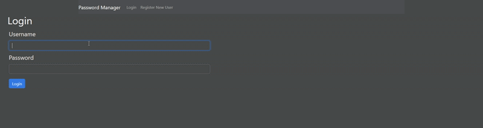

# Password Manager

Deployed at: [https://www.a-tran.dev](https://www.a-tran.dev)

[](https://codecov.io/github/alext111/password-manager)


A full-stack password manager built with the MERN stack (MongoDB, Express, React, Node.js) that demonstrates secure credential storage concepts, REST API design, testing, and cloud deployment practices.

## Live Demo


## ⚠️ Disclaimer

This application is **not a production-ready password manager** and should **not be used to store real or sensitive credentials**.

## Description
The application allows users to generate, encrypt, store, and retrieve passwords through a web interface.

Key features include:

- Secure password hashing (bcrypt)
- AES encryption for stored credentials (with IV + salt)
- Full CRUD operations
- JWT User authentication
- REST API architecture
- Protected API routes
- CI/CD pipeline with automated testing
- Dockerized development environment

## System Architecture

The frontend communicates with a REST API backend, which handles authentication, encryption, and database operations. All sensitive operations are protected via JWT middleware and scoped to the authenticated user.

## Tech Stack

### Frontend

- React
- Axios
- React Router
- Styled Components
- Bootstrap

Responsibilities:

- User interface and form handling
- Password management dashboard
- Communication with backend API

### Backend

- Node.js
- Express
- MongoDB
- Mongoose

Responsibilities:

- REST API endpoints
- Password generation logic
- AES encryption and decryption
- Database persistence

## Testing

### Unit Tests (Jest)

#### Frontend
Test coverage includes:

- Component rendering
- User interactions
- API integration behavior

#### Backend
Test coverage includes:

- API endpoint behavior
- Password generation logic
- Encryption functionality
- Database interactions

### End-to-End Tests (Cypress)

E2E tests validate complete user flows through the browser against a running instance of the application.

#### Flows covered

- User registration (valid, duplicate username, mismatched passwords)
- Login and logout
- Create a credential
- Find all credentials
- Find a credential by website
- Update a credential
- Delete a credential

## Security Features
- Password hashing using bcrypt
- JWT authentication
- Encrypted password storage using AES encryption
- User-specific credential isolation (users can only access their own data)
- Protected API routes using authentication middleware

### Authentication (JWT)
This application uses JSON Web Token (JWT) authentication to secure API routes and associate stored credentials with individual users.

#### Authentication Flow
1. User Registration
    - User creates an account with username and password
    - Password is hashed using bcrypt
    - User is stored in MongoDB
    
2. User Login
    - User submits username and password
    - Password is validated using bcrypt
    - Server generates a JWT token
    - Token is returned to the client

3. Authenticated Requests
    - The JWT token is stored in localStorage
    - The token is sent in the Authorization header for API requests

4. Auth Middleware
    - Backend middleware verifies the JWT
    - If valid, the user ID is attached to the request
    - All credential operations are performed using the authenticated user's ID
    
5. Protected Routes
    - Users can only access, update, or delete credentials that belong to their account


## API Endpoints

| Method | Endpoint                     | Description                  | Auth Required |
|--------|------------------------------|------------------------------|--------------|
| POST   | /api/auth/register           | Create new user              | No           |
| POST   | /api/auth/login              | Login user                   | No           |
| GET    | /api/credentials             | Get all credentials          | Yes          |
| GET    | /api/credentials/:website    | Get credential by website    | Yes          |
| POST   | /api/credentials             | Create new credential        | Yes          |
| PUT    | /api/credentials/:website    | Update credential            | Yes          |
| DELETE | /api/credentials/:website    | Delete credential            | Yes          |
| GET    | /api/decrypt/:website        | Decrypt password             | Yes          |


## Cloud Deployment (AWS)

The application is deployed on Amazon Web Services (AWS) using an EC2 instance.

Infrastructure components include:

### EC2
Runs the Node.js backend and serves the React frontend.

### Nginx

Configured as a reverse proxy to:

- Handle HTTPS traffic
- Forward requests to the Node.js application
- Improve security and performance

### SSL / HTTPS
Traffic is secured using HTTPS certificates.

### Deployment Architecture


## CI/CD Pipeline

A GitHub Actions workflow automatically builds and tests the application.

### Continuous Integration

On every push:

- Install dependencies
- Run backend tests
- Run frontend tests
- Validate build

### Continuous Deployment

Successful builds trigger deployment to the AWS EC2 instance where the updated application is pulled and restarted.


## Running the Project Locally

### Environment Variables

Create a `.env` file in the server directory:

```env
ENCRYPTION_KEY='your_secret_32_length_char_here_' # Must be 32 characters long
JWT_SECRET='your_secret_key'
MONGO_URI='mongodb://localhost:27017/password-manager'
```

For Docker, these are configured in docker-compose.yml.

### Docker Method (Recommended)

#### Prerequisites
- Docker
- Docker Compose

#### Run the application

1. Clone the repository

git clone https://github.com/alext111/password-manager.git  
cd password-manager

2. Build and start containers

docker-compose up --build

3. Access the app

Frontend: http://localhost:3000  
Backend API: http://localhost:3001

### Stop the application

docker-compose down

### Without Docker

#### Prerequisites

- Node.js
- MongoDB

MongoDB Community Server can be downloaded here:
https://www.mongodb.com/try/download/community


1. Clone the repository
    git clone https://github.com/alext111/password-manager.git
    cd password-manager

2. Install dependencies
    cd server
    npm install

    cd ../client
    npm install

3. Configure MongoDB

    Update the database connection in:
    server/db/index.js

    Example:
    mongodb://localhost:27017/password-manager

4. Start the application

    Backend:

    cd server
    node index.js

    Frontend:

    cd client
    npm start


